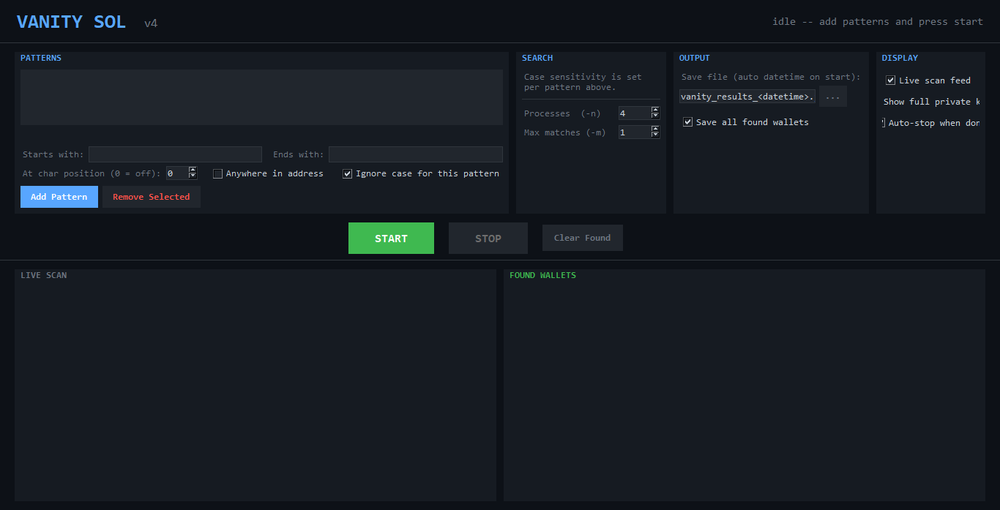
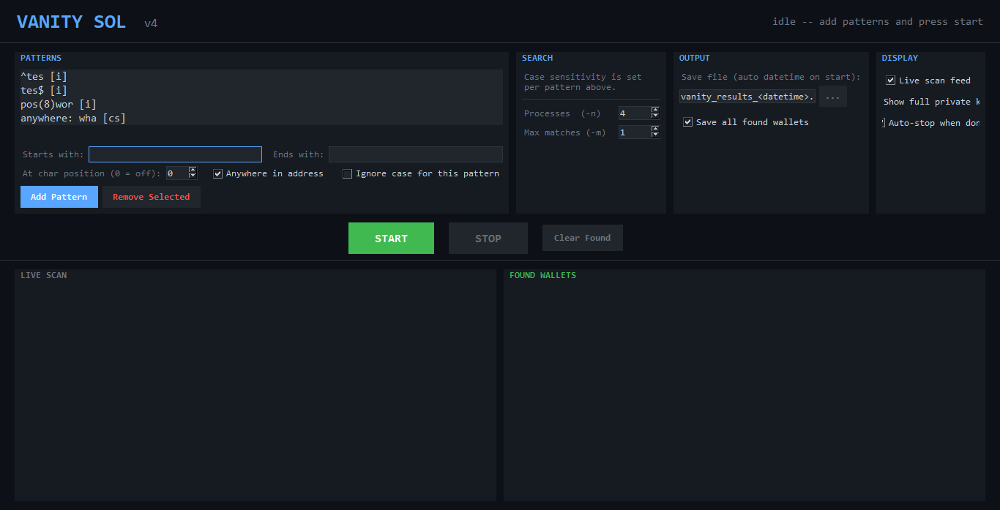
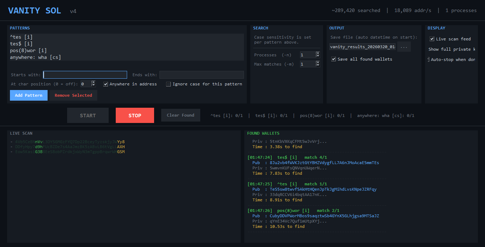
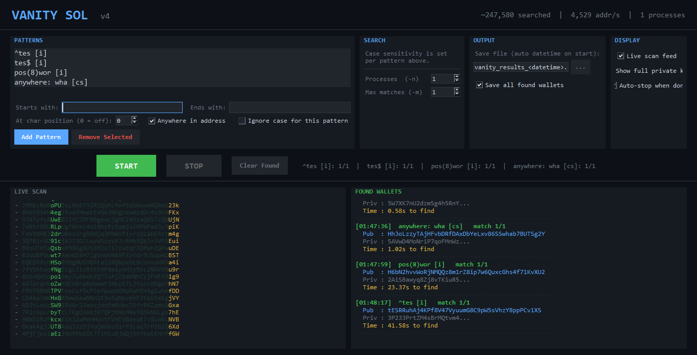

# Vanity SOL

A toolkit for generating Solana wallet addresses that match custom text patterns. Includes the original CLI script and a full GUI application.

Major GUI upgrade and feature expansion by [@aq1onyt](https://github.com/aq1onyt).

---






---

## Table of Contents

1. [Requirements](#requirements)
2. [Installation](#installation)
3. [Base58 - Valid Characters](#base58--valid-characters)
4. [vanity.py - CLI](#vanitypy--cli)
5. [vanity.py - GUI](#vanitypy--gui)
6. [GUI Features as CLI Commands](#gui-features-as-cli-commands)
7. [Output Files](#output-files)
8. [How Fast Is It](#how-fast-is-it)
9. [Credits](#credits)
10. [License](#license)

---

## Requirements

- Python 3.8+
- `solders` - Rust-backed Solana keypair generation
- `base58` - private key encoding

```bash
pip install solders base58
```

`tkinter` is used by the GUI and comes bundled with standard Python on Windows. No extra install needed.

---

## Installation

```bash
git clone <repo>
cd vanity-sol
pip install solders base58
```

---

## Base58 - Valid Characters

Solana addresses are base58 encoded. Base58 deliberately excludes characters that look visually similar to avoid confusion:

| Excluded | Reason |
|---|---|
| `0` (zero) | looks like `O` |
| `O` (capital o) | looks like `0` |
| `I` (capital i) | looks like `l` |
| `l` (lowercase L) | looks like `I` |

**Valid characters**: `123456789ABCDEFGHJKLMNPQRSTUVWXYZabcdefghijkmnopqrstuvwxyz`

All scripts validate input against this set before searching. The GUI shows an inline error message if you enter an invalid character.

---

## vanity.py - CLI

The original script. Searches for a single pattern using multiple CPU processes.

```bash
python vanity.py -v <text> [options]
```

### Flags

| Flag | Short | Default | Description |
|---|---|---|---|
| `--vanity-text` | `-v` | required | Text to search for in the address |
| `--max-matches` | `-m` | `1` | Number of matching addresses to find before stopping |
| `--match-end` | `-e` | off | Match the text at the **end** of the address instead of the start |
| `--ignore-case` | `-i` | off | Case-insensitive - `Sbh` matches `sbh`, `SBH`, `SbH` |
| `--num-processes` | `-n` | CPU count | Number of parallel worker processes |

### How it works

- Spawns `n` worker processes, each generating keypairs independently in a tight loop
- Workers send matches and progress updates back to the main process via a `multiprocessing.Queue`
- Progress is printed as a rolling total: `Searched 40000 addresses`
- On match, writes `{ public_key, secret_key }` to a JSON file immediately
- File is named after the search text, e.g. `abc-vanity-address.json`

### Examples

```bash
# find one address starting with "abc" (uses all CPU cores by default)
python vanity.py -v abc

# find 3 addresses ending with "sbh", case-insensitive, using 8 processes
python vanity.py -v sbh -m 3 -e -i -n 8

# find one address starting with "pump" using exactly 4 processes
python vanity.py -v pump -n 4
```

### Output file

Named `<text>-vanity-address.json` (plural `addresses` when `--max-matches` > 1):

```json
[
  {
    "public_key": "abc8w8oYfk3hDvJt7KbBZcWbMeu8Rv6mLhPw75jYLZc",
    "secret_key": "st9Rfygc6UJmQ5ndnPWwxRsvXtP45x..."
  }
]
```

---

## vanity.py - GUI

The full graphical interface. Adds multi-pattern support and advanced matching options not available in the CLI.

```bash
python vanity.py
```

---


### Window layout

```
+------------------------------------------------------------------+
| VANITY SOL               ~50,000 searched | 12,500 addr/s     |
+------------------------------------------------------------------+
| PATTERNS       | SEARCH          | OUTPUT        | DISPLAY        |
|                |                 |               |                |
| [listbox of    | Case sensitivity| Save file     | Live scan feed |
|  added         | is set per      | [filename] [..]| Show full priv |
|  patterns]     | pattern above.  | Save all found | Auto-stop      |
|                |                 |               |                |
| Starts with: []| Processes: [4]  |               |                |
| Ends with:   []| Max matches: [1]|               |                |
| At position: []|                 |               |                |
| [Anywhere in address]           |               |                |
| [Ignore case for this pattern]  |               |                |
| [Add Pattern] [Remove Selected] |               |                |
+------------------------------------------------------------------+
|  [ START ]          [ STOP ]         [ Clear Found ]             |
|  ^abc [i]: 0/1  |  xyz$ [cs]: 0/1                               |
+--------------------------------+---------------------------------+
| LIVE SCAN                      | FOUND WALLETS                   |
| - AbcXyz1234...                | [14:30:22]  ^abc [i]  match 1/1 |
| - QrstuVwxyz...                |   Pub  : abc8w8oYfk3hDv...      |
| - MnopQrst12...                |   Priv : st9Rfygc6UJmQ5...      |
| (fast scroll)                  |   Time : 14.32s to find         |
|                                | -------------------------------- |
+--------------------------------+---------------------------------+
| Status: Running -- 4 processes -- saving to: vanity_results_...  |
+------------------------------------------------------------------+
```

---


### PATTERNS panel

This is where you define what to search for. Each pattern you add runs simultaneously with all others.

---

#### Starts with

The text the address must begin with. Leave blank if you only care about the suffix or position.

**Equivalent CLI flag:** `-v <text>` (without `-e`)

```bash
# GUI: Starts with = "abc"  →  CLI:
python vanity.py -v abc
```

---

#### Ends with

The text the address must end with. Leave blank if you only care about the prefix.

**Equivalent CLI flag:** `-v <text> -e`

```bash
# GUI: Ends with = "xyz"  →  CLI:
python vanity.py -v xyz -e
```

---

#### Starts with AND Ends with simultaneously

Fill both fields to find a single address that matches **both ends at the same time**.

The regex used internally is `^{prefix}.*{suffix}$` - meaning the address starts with the prefix, ends with the suffix, and has anything in between.

Example: prefix `abc`, suffix `xyz` → finds an address like `abc4K9...mxyz`

> **No CLI equivalent.** The CLI only supports one anchor per run (start or end, not both). This is a GUI-only feature.

---

#### At char position (0 = off)

Specifies the exact character index (0-based) at which the text in "Starts with" must appear.

| Spinbox value | Effect |
|---|---|
| `0` | disabled - pattern anchors at the start of the address normally |
| `1` | text appears starting at character index 1 (second character) |
| `2` | text appears starting at character index 2 (third character) |
| `5` | text appears starting at character index 5 |

Regex generated: `^.{N}{prefix}` where N is the position value.

Example: position `2`, starts with `abc` → regex `^.{2}abc` → matches `XXabc...`

Can be combined with "Ends with": position `2`, starts with `abc`, ends with `xyz` → `^.{2}abc.*xyz$`

> **No CLI equivalent.** The CLI anchors patterns only at position 0 (start) or at the end. Custom positional matching is a GUI-only feature.

---

#### Anywhere in address

When ticked, all position and anchor settings are ignored. The text is searched for anywhere in the address - beginning, middle, or end.

Regex generated: `{text}` with no `^` or `$` anchors.

Example: `smart` anywhere → matches `ABCsmartXYZ`, `smartABC`, `ABCsmart`

This is statistically easier to find than a prefix match of the same length because there are more positions where a match can occur.

> **No CLI equivalent.** The CLI always anchors patterns at the start or end.

---

#### Ignore case for this pattern

Each pattern has its own independent case sensitivity setting. Tick this before clicking "Add Pattern" to make that specific pattern case-insensitive.

- Case-insensitive patterns are labelled `[i]` in the list (e.g. `^abc [i]`)
- Case-sensitive patterns are labelled `[cs]` (e.g. `^Sbh [cs]`)
- You can mix - one pattern case-insensitive and another case-sensitive in the same run

**Equivalent CLI flag:** `-i` (applies globally to the whole run in the CLI - per-pattern control is GUI-only)

```bash
# GUI: pattern "abc" with ignore case  →  CLI:
python vanity.py -v abc -i
```

---

#### Pattern labels in the listbox

Each added pattern shows a descriptive label:

| Label | What it matches |
|---|---|
| `^abc [i]` | address starts with abc, case-insensitive |
| `xyz$ [cs]` | address ends with xyz, case-sensitive |
| `^abc ... xyz$ [i]` | starts with abc AND ends with xyz, case-insensitive |
| `pos(2)abc [cs]` | abc appears at character index 2, case-sensitive |
| `pos(2)abc ... xyz$ [i]` | abc at index 2 AND ends with xyz, case-insensitive |
| `anywhere: smart [i]` | smart appears anywhere, case-insensitive |

---

#### Add Pattern button

Validates both fields, then adds the pattern to the list. Pressing **Enter** in either text field does the same thing.

#### Remove Selected button

Click a pattern in the list to highlight it, then click this to remove it.

---

#### Inline error messages

If you type a character that is not valid in a Solana address, a red error message appears below the listbox and clears after 4 seconds. No action is taken - fix the input and try again.

---

### SEARCH panel

#### Case sensitivity note

Case sensitivity is controlled **per pattern** in the patterns panel above (see "Ignore case for this pattern"). There is no global case toggle.

**CLI equivalent:** `-i` flag, which applies to the whole run.

#### Processes (-n)

Number of parallel worker processes. Defaults to your CPU core count.

- Each process independently generates and checks keypairs
- More processes = proportionally more addresses checked per second
- Going significantly above your physical core count gives diminishing returns

**Equivalent CLI flag:** `-n <number>`

```bash
# GUI: Processes = 8  →  CLI:
python vanity.py -v abc -n 8
```

#### Max matches (-m)

How many matching addresses to find per pattern. Once a pattern reaches this count it stops contributing to new matches, but the search continues until all patterns are satisfied.

**Equivalent CLI flag:** `-m <number>`

```bash
# GUI: Max matches = 3  →  CLI:
python vanity.py -v abc -m 3
```

---

### OUTPUT panel

#### Save file

The path and filename to write results to. Defaults to `vanity_results_<datetime>.json`.

When you press **START**, the `<datetime>` placeholder is replaced with the actual timestamp:
```
vanity_results_20260320_143022.json
```

Each run generates a new uniquely named file - previous results are never overwritten.

Click `...` to open a file picker and choose a custom location or name.

After pressing **STOP**, the filename resets to the placeholder so the next run gets a fresh name.

**CLI equivalent:** the CLI names the file after the search text, e.g. `abc-vanity-address.json`.

#### Save all found wallets

When ticked, every match is written to the save file the moment it is found.

Each JSON entry contains:

```json
{
  "public_key":      "abc8w8oYfk3hDv...",
  "secret_key":      "st9Rfygc6UJmQ5...",
  "matched_pattern": "^abc [i]",
  "found_at":        "2026-03-20T14:30:22.481203",
  "time_to_find_s":  14.32
}
```

When unticked, matches are displayed in the GUI but nothing is saved to disk.

**CLI equivalent:** the CLI always saves found wallets - there is no option to disable saving.

---

### DISPLAY panel

#### Live scan feed

When ticked, the left panel shows a live scrolling feed of addresses as they are generated, updated every 80ms.

- The **prefix** portion of each address (length = longest "Starts with" pattern) is highlighted green
- The **suffix** portion (length = longest "Ends with" pattern) is highlighted yellow
- The rest of each address is shown in dim green

When unticked, the panel shows a static placeholder and the queue is silently drained. Disabling the feed has no effect on search speed.

**CLI equivalent:** none. The CLI prints progress counts but does not show individual addresses.

#### Show full private key

When ticked, the complete 88-character base58 private key is shown for every found wallet in the Found Wallets panel.

When unticked, only the first 20 characters are shown followed by `...`

The full key is always saved to the JSON file regardless of this setting.

> Keep private keys secure. Anyone with the private key has full control over the wallet and all funds in it.

**CLI equivalent:** the CLI always prints a truncated key to the terminal but saves the full key to the JSON file.

#### Auto-stop when done

When ticked, the search automatically stops when every pattern has found its `max_matches` quota.

When unticked, the search runs indefinitely even after all patterns are satisfied - useful if you want to keep collecting more matches beyond the quota without manually pressing START again.

**CLI equivalent:** the CLI always stops automatically when the quota is met - there is no equivalent to "keep running" mode.

---

### Control bar

#### START button

- Validates that at least one pattern exists
- Generates the timestamped output filename
- Spawns the configured number of worker processes
- Begins the search
- Disables itself and enables STOP while running

**CLI equivalent:** running the CLI script.

#### STOP button

- Terminates all worker processes immediately
- Resets the filename placeholder for the next run
- Re-enables START

**CLI equivalent:** pressing `Ctrl+C` in the terminal.

#### Clear Found button

Clears the Found Wallets panel on the right side. Does not delete or modify the save file on disk.

**CLI equivalent:** none.

#### Pattern progress bar

Displayed to the right of the buttons. Shows the current match count for every active pattern.

Example:
```
^abc [i]: 1/3  |  xyz$ [cs]: 0/3  |  anywhere: smart [i]: 2/3
```

Updates every time a new match is found.

**CLI equivalent:** `Checked 50000 wallets | abc:1/3` printed to the terminal.

---


### Live scan panel (left)

Shows the raw addresses being generated in real time. Scrolls fast - at high process counts it will be faster than readable. This is expected.

- Green characters = the prefix region (length of your longest "Starts with" pattern)
- Yellow characters = the suffix region (length of your longest "Ends with" pattern)
- Dim characters = the middle portion of the address

Toggled by the "Live scan feed" checkbox in the DISPLAY panel.

**CLI equivalent:** none. The CLI prints progress counts, not individual addresses.

---


### Found Wallets panel (right)

Every match appears here immediately. Scrolls and persists across the session until "Clear Found" is pressed.

```
[14:30:22]  ^abc [i]   match 1/3
  Pub  : abc8w8oYfk3hDvJt7KbBZcWbMeu8Rv6mLhPw75jYLZc
  Priv : st9Rfygc6UJmQ5ndnPWwx...
  Time : 14.32s to find
--------------------------------------------------------
```

- **Timestamp** - wall-clock time the match was found
- **Pattern label** - which pattern matched and which occurrence this is out of max
- **Pub** - the full public key (the wallet address)
- **Priv** - private key, truncated unless "Show full private key" is ticked
- **Time** - seconds elapsed from pressing START to finding this match

**CLI equivalent:** the CLI prints match details to the terminal in a similar format.

---

### Header stats bar

Updates every second while running:

```
~240,000 searched  |  16,000 addr/s  |  4 processes
```

- `searched` - estimated total addresses checked, based on scan queue throughput
- `addr/s` - estimated addresses per second across all processes combined
- `processes` - the current worker count from the SEARCH panel

The count is sampled (every 20th address is counted), so the actual total is slightly higher than displayed.

**CLI equivalent:** `Checked 240000 wallets` printed to the terminal.

---

### Status bar

The thin bar at the very bottom of the window. Shows the most recent system message:

| Message | When it appears |
|---|---|
| `Ready.` | at startup, before starting |
| `Running -- 4 processes -- saving to: vanity_results_....json` | while searching |
| `Match found for '^abc [i]' in 14.32s -- saved to ...` | each time a match is found |
| `Stopped.` | after pressing STOP or auto-stopping |
| `Save error: <detail>` | if the JSON file cannot be written |

---

### Keyboard shortcut

| Key | Action |
|---|---|
| **Enter** | When focused on the "Starts with" or "Ends with" field, adds the current pattern |

---

## GUI Features as CLI Commands

This section maps every GUI option to its CLI equivalent using `vanity.py`, and clearly marks features that are GUI-only.

### Basic prefix search

```bash
# GUI: Starts with = "abc", ignore case ticked, 4 processes, max matches = 1
python vanity.py -v abc -i -n 4 -m 1
```

### Suffix search

```bash
# GUI: Ends with = "xyz", case-sensitive, 4 processes
python vanity.py -v xyz -e -n 4
```

### Multiple matches per pattern

```bash
# GUI: Starts with = "sbh", max matches = 5, ignore case, 8 processes
python vanity.py -v sbh -m 5 -i -n 8
```

### Ignore case

```bash
# GUI: pattern "abc", ignore case ticked
python vanity.py -v abc -i
```

Note: the CLI `-i` flag applies to the whole run. The GUI lets each pattern have its own case setting - there is no CLI equivalent for per-pattern case control.

### Prefix AND suffix on the same address - GUI only

```bash
# GUI: Starts with = "abc", Ends with = "xyz" (same address must match both)
# regex used internally: ^abc.*xyz$
# no CLI equivalent
```

### At character position - GUI only

```bash
# GUI: At position = 2, Starts with = "abc"
# regex used internally: ^.{2}abc
# no CLI equivalent
```

### Anywhere in address - GUI only

```bash
# GUI: Starts with = "smart", Anywhere checkbox ticked
# regex used internally: smart  (no anchors)
# no CLI equivalent - the CLI always anchors to start or end
```

### Running multiple advanced patterns at the same time

The GUI lets you stack as many patterns as you want, each with its own type and case setting. All patterns run simultaneously across all worker processes - any address that satisfies any pattern is recorded, and the search continues until every pattern has hit its quota.

The CLI only supports a single pattern per run. To search for multiple things at once you would need to run separate terminal windows.

**Example: three patterns running in one session**

Say you want to find addresses matching any of these at the same time:

| Pattern | Type | Case |
|---|---|---|
| `ha` at character position 2 | at position | case-sensitive |
| `ha` at the end | suffix | case-sensitive |
| `HA` anywhere in the address | anywhere | ignore case |

In the GUI, click "Add Pattern" three times:

1. Set "At char position" to `2`, fill "Starts with" as `ha`, leave "Ignore case" unticked → Add
2. Clear fields, fill "Ends with" as `ha`, leave "Ignore case" unticked → Add
3. Clear fields, fill "Starts with" as `HA`, tick "Anywhere in address", tick "Ignore case" → Add

The listbox will show:
```
pos(2)ha [cs]
ha$ [cs]
anywhere: HA [i]
```

All three run in parallel across all processes. The first address matching any of those three patterns is recorded. The search only stops when each pattern has found its `max_matches` count.

The CLI can only do the suffix match from this example:

```bash
# closest CLI equivalent - suffix only, no position or anywhere support:
python vanity.py -v ha -e -n 4
```

The position and anywhere patterns have no CLI equivalent.

### All CLI flags combined

```bash
# everything the CLI supports in one command:
python vanity.py -v abc -m 3 -e -i -n 8
# finds 3 addresses ending with "abc", case-insensitive, using 8 processes
```

---

## Output Files

| File | Created by | Contents |
|---|---|---|
| `<text>-vanity-address.json` | CLI | Found addresses for that search text |
| `vanity_results_YYYYMMDD_HHMMSS.json` | GUI | All found addresses with timestamps and time-to-find |

All output files are JSON arrays. Each GUI run creates a new uniquely named file - nothing is ever overwritten between runs.

### CLI output format

```json
[
  {
    "public_key": "abc8w8oYfk3hDvJt7KbBZcWbMeu8Rv6mLhPw75jYLZc",
    "secret_key": "st9Rfygc6UJmQ5ndnPWwxRsvXtP45x..."
  }
]
```

### GUI output format

```json
{
  "public_key":      "abc8w8oYfk3hDvJt7KbBZcWbMeu8Rv6mLhPw75jYLZc",
  "secret_key":      "st9Rfygc6UJmQ5ndnPWwxRsvXtP45xWKTBLvFmwje2wz...",
  "matched_pattern": "^abc [i]",
  "found_at":        "2026-03-20T14:30:22.481203",
  "time_to_find_s":  14.32
}
```

---

## How Fast Is It

Speed depends entirely on CPU and process count. Rough estimates on a modern desktop:

| Setup | Approximate speed |
|---|---|
| CLI (4 cores) | 40,000 - 100,000 addr/s |
| GUI (8 cores) | 80,000 - 200,000 addr/s |

Expected addresses to check before finding a match (prefix, case-sensitive):

| Pattern length | Expected attempts |
|---|---|
| 1 character | ~58 |
| 2 characters | ~3,400 |
| 3 characters | ~195,000 |
| 4 characters | ~11,300,000 |
| 5 characters | ~656,000,000 |
| 6 characters | ~38,000,000,000 |

Each additional character multiplies difficulty by ~58 (the base58 alphabet size). Case-insensitive matching roughly halves the difficulty per alphabetic character since both cases become valid.

Test your machine's raw generation speed:

```bash
python -c "
from solders.keypair import Keypair
import time
start = time.time()
for i in range(10000):
    Keypair()
elapsed = time.time() - start
print(f'{10000/elapsed:,.0f} keys/sec  =  {10000/elapsed*60:,.0f} keys/min')
"
```

---

## Credits

### Original author

[@n3tn1nja](https://github.com/n3tn1nja) created the original Vanity SOL project. The core keypair generation loop, and the foundation that everything else is built on all come from his work. None of this exists without the original.

### Major contributor

A massive thank you to [@aq1onyt](https://github.com/aq1onyt) for taking n3tn1nja's original script and building a complete GUI application on top of it - a full tkinter interface that exposes every feature of the original and adds several new ones that have no CLI equivalent:

- Full dark-theme GUI with live scan feed and found wallets panel
- Multi-pattern support - run as many patterns simultaneously as you want
- Per-pattern case sensitivity (each pattern has its own ignore-case toggle)
- Prefix and suffix simultaneous matching on a single address
- Character position targeting (match text starting at a specific index)
- Anywhere-in-address matching with no anchors
- Auto-timestamped output filenames and time-to-find recording
- All documentation in this README

This upgrade takes the original single-pattern CLI tool and wraps it in a professional interface that makes all the advanced options accessible without touching the terminal.

---

## License

Apache License 2.0 - see the LICENSE file in the repository for details.
